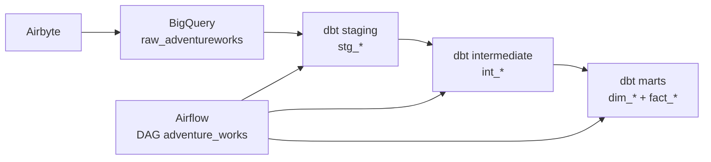

# projeto-adventureworks

Pipeline de engenharia de dados para o dataset **Adventure Works**, cobrindo ingestão, transformação e orquestração.

**Stack:** Airbyte → BigQuery → dbt → Apache Airflow (Astronomer Astro + Cosmos)

---

## Visão geral

O projeto implementa um pipeline medallion no BigQuery:

1. **Raw** — tabelas ingeridas pelo Airbyte no schema `raw_adventureworks`
2. **Staging** — limpeza e padronização das fontes (`stg_*`)
3. **Intermediate** — joins e regras de negócio (`int_*`, materialização ephemeral)
4. **Marts** — modelo dimensional com dimensões e fato de vendas

A orquestração é feita pelo Airflow via [Astronomer Cosmos](https://github.com/astronomer/astro-sdk), que gera automaticamente as tasks do dbt a partir do projeto.



---

## Estrutura do repositório

```
projeto-adventureworks/
├── dags/
│   ├── adventure_works.py          # DAG principal (Cosmos DbtDag)
│   └── dbt/adventure_works/        # Projeto dbt
│       ├── models/
│       │   ├── staging/sales/      # 23 modelos stg_*
│       │   ├── int/sales/          # 10 modelos int_*
│       │   └── marts/sales/        # 9 dimensões + 1 fato
│       ├── macros/
│       ├── profiles.yml
│       └── dbt_project.yml
├── include/
│   ├── constants.py                # Caminhos do projeto e dbt
│   └── profiles.py                 # ProfileConfig do Cosmos
├── tests/dags/                     # Testes de integridade das DAGs
├── Dockerfile                      # Astro Runtime + dbt-bigquery
├── docker-compose.prod.yml         # Override para ambiente de produção
├── requirements.txt                # astronomer-cosmos
├── .env.example                    # Variáveis de ambiente (template)
└── .credentials/                   # Chaves GCP (não versionado)
```

---

## Modelos dbt

### Fontes (`sales_source.yml`)

Schema de origem: `raw_adventureworks` (BigQuery), carregado pelo Airbyte.

Domínios cobertos: **Sales**, **Person**, **Production** e **Purchasing**.

### Staging — 23 modelos

| Modelo | Tabela de origem |
|--------|------------------|
| `stg_sales_customer` | SalesCustomer |
| `stg_sales_store` | SalesStore |
| `stg_sales_credit_card` | SalesCreditCard |
| `stg_sales_country_region_code` | SalesCountryRegionCurrency |
| `stg_sales_currency` | SalesCurrency |
| `stg_sales_currency_rate` | SalesCurrencyRate |
| `stg_sales_order_header` | SalesSalesOrderHeader |
| `stg_sales_orders_details` | SalesSalesOrderDetail |
| `stg_sales_order_header_sales_reason` | SalesSalesOrderHeaderSalesReason |
| `stg_sales_person` | SalesSalesPerson |
| `stg_sales_person_credit_card` | SalesPersonCreditCard |
| `stg_sales_reason` | SalesSalesReason |
| `stg_sales_special_offer` | SalesSpecialOffer |
| `stg_sales_territory` | SalesSalesTerritory |
| `stg_person_person` | PersonPerson |
| `stg_person_adress` | PersonAddress |
| `stg_person_adress_type` | PersonAddressType |
| `stg_person_state_province` | PersonStateProvince |
| `stg_production_product` | ProductionProduct |
| `stg_production_product_category` | ProductionProductCategory |
| `stg_production_product_subcategory` | ProductionProductSubcategory |
| `stg_production_product_model` | ProductionProductModel |
| `stg_purchasing_ship_method` | PurchasingShipMethod |

### Intermediate — 10 modelos

| Modelo | Descrição |
|--------|-----------|
| `int_customer_joined` | Cliente + loja + pessoa |
| `int_order_joined` | Pedido (header + detail + motivo) |
| `int_product_joined` | Hierarquia de produto |
| `int_adress` | Endereços |
| `int_credit_card` | Cartões de crédito |
| `int_currency_rate` | Taxas de câmbio |
| `int_sales_reason` | Motivos de venda |
| `int_sales_special_offer` | Ofertas especiais |
| `int_ship_method` | Métodos de envio |
| `int_territory` | Territórios |

### Marts — modelo dimensional

| Tipo | Modelos |
|------|---------|
| Dimensões | `dim_customer`, `dim_product`, `dim_adress`, `dim_credit_card`, `dim_currency_rate`, `dim_sales_reason`, `dim_special_offer`, `dim_ship_method`, `dim_territory` |
| Fato | `fact_sales_orders` |

---

## Pré-requisitos

- [Docker](https://www.docker.com/)
- [Astro CLI](https://www.astronomer.io/docs/astro/cli/install-cli)
- Conta GCP com BigQuery habilitado
- Service account com permissões `BigQuery Data Editor` e `BigQuery Job User`
- Dados Adventure Works ingeridos no BigQuery via Airbyte (schema `raw_adventureworks`)

---

## Configuração

### 1. Variáveis de ambiente

Copie o template e preencha com seus valores:

```bash
cp .env.example .env
```

| Variável | Descrição |
|----------|-----------|
| `GCP_DEV_PROJECT` | Projeto GCP de desenvolvimento |
| `DBT_DEV_SCHEMA` | Dataset base de desenvolvimento |
| `GCP_DEV_KEYFILE_PATH` | Caminho da key JSON de dev (dentro do container) |
| `GCP_PROD_PROJECT` | Projeto GCP de produção |
| `DBT_PROD_SCHEMA` | Dataset base de produção |
| `GCP_PROD_KEYFILE_PATH` | Caminho da key JSON de produção (dentro do container) |
| `DBT_TARGET` | Target ativo no Airflow: `dev` ou `prod` |

### 2. Credenciais GCP

Coloque os arquivos JSON da service account em:

```
.credentials/gcp-dev-key.json    # desenvolvimento
.credentials/gcp-prod-key.json   # produção
```

> **Importante:** arquivos em `.credentials/` e `include/gcp-*-key.json` estão no `.gitignore`. Nunca commite chaves de service account.

No ambiente local com `astro dev`, o diretório `include/` é montado automaticamente no container. Para produção com Docker, use o volume definido em `docker-compose.prod.yml`.

### 3. Profiles dbt

O arquivo `dags/dbt/adventure_works/profiles.yml` define os targets `dev` e `prod`, ambos usando autenticação por service account no BigQuery. As credenciais são lidas das variáveis de ambiente acima.

O Airflow/Cosmos usa `include/profiles.py`, que aponta para o mesmo `profiles.yml` e respeita a variável `DBT_TARGET`.

---

## Desenvolvimento local

### Subir o ambiente Astro

```bash
astro dev start
```

- **Airflow UI:** http://localhost:8080 (ou URL exibida pelo CLI)
- Credenciais padrão: `admin` / `admin`

O arquivo `.env` na raiz é carregado automaticamente pelo Astro.

### Executar dbt manualmente (dentro do container)

```bash
astro dev bash

/usr/local/airflow/dbt_venv/bin/dbt debug \
  --project-dir /usr/local/airflow/dags/dbt/adventure_works \
  --profiles-dir /usr/local/airflow/dags/dbt/adventure_works

/usr/local/airflow/dbt_venv/bin/dbt build \
  --project-dir /usr/local/airflow/dags/dbt/adventure_works \
  --profiles-dir /usr/local/airflow/dags/dbt/adventure_works
```

### Executar via Airflow

1. Acesse a UI do Airflow
2. Ative a DAG `adventure_works`
3. Dispare manualmente (a DAG não possui schedule — `schedule=None`)

---

## Ambiente de produção

### Comportamento dev vs prod

A macro `generate_schema_name` controla onde os modelos são gravados no BigQuery:

| Target | Comportamento no BigQuery |
|--------|---------------------------|
| `dev` | Todos os modelos em **um único dataset** (`DBT_DEV_SCHEMA`) |
| `prod` | Modelos separados por camada: datasets `stg`, `int` e `marts` |

Para rodar em produção, configure no `.env` ou no deployment:

```bash
DBT_TARGET=prod
GCP_PROD_PROJECT=seu-projeto-gcp-prod
DBT_PROD_SCHEMA=seu_schema_prod
GCP_PROD_KEYFILE_PATH=/usr/local/airflow/.credentials/gcp-prod-key.json
```

### Deploy com Docker

```bash
# Build da imagem
astro dev build

# Ou com Docker diretamente
docker build -t adventureworks:latest .
```

Para containers de produção, use `docker-compose.prod.yml` como override — ele injeta `DBT_TARGET=prod` e monta a key de produção:

```bash
docker compose -f docker-compose.prod.yml up -d
```

Para deploy no **Astronomer Cloud**:

```bash
astro deploy --deployment-name <nome-do-deployment>
```

Configure as variáveis `GCP_PROD_*` e `DBT_TARGET=prod` nas configurações do deployment no painel da Astronomer.

---

## DAGs

| DAG | Arquivo | Descrição |
|-----|---------|-----------|
| `adventure_works` | `dags/adventure_works.py` | Executa o projeto dbt completo via Cosmos |
| `example_astronauts` | `dags/exampledag.py` | DAG de exemplo do template Astro |

A DAG `adventure_works` usa:

- **Cosmos `DbtDag`** — gera tasks automaticamente a partir dos modelos dbt
- **dbt executable** — `/usr/local/airflow/dbt_venv/bin/dbt` (venv criado no Dockerfile)
- **Retries** — 2 tentativas em caso de falha

---

## Testes

```bash
# Testes de integridade das DAGs (Astro)
astro dev pytest

# Testes unitários do projeto
pytest tests/
```

---

## Tecnologias

| Componente | Versão / Detalhe |
|------------|------------------|
| Astro Runtime | 3.2-5 |
| Apache Airflow | 3.x (via Astro Runtime) |
| astronomer-cosmos | 1.x |
| dbt-bigquery | instalado no Dockerfile |
| BigQuery | Data warehouse |
| Airbyte | Ingestão (upstream) |

---

## Segurança

- Não commite `.env`, `.credentials/` nem arquivos `*service_account*.json`
- Use service accounts distintas para dev e prod
- Em produção, prefira montar credenciais via volume ou secrets do orchestrator, não embutir no image

---

## Licença

Projeto educacional de engenharia de dados.
